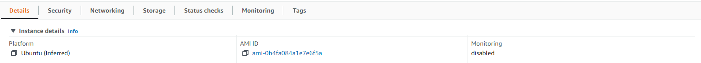

# Shrinking a Root EBS Volume

**Situation:** We have an EC2 instance and a root EBS volume where we want to shrink the size

**Step 0:** We'll call the existing EC2 instance **IA** and the existing EBS volume **VA**

**Step 1:** Create a new EC2 instance (We'll call this **IB**) using the AMI from **IA** (You can do this by clicking the Instance details, click the AMI ID, and clicking Launch instance from AMI) and the same type (e.g. r6gd.2xlarge). When selecting the root drive for **IB**, select the same type as **VA** and make it the target size that you'd like to shrink **VA** to, we'll call this drive **VB**



**Step 2:** SSH into **IB** and upgrade/downgrade the OS to match **IA** as needed. Ensure the welcome messages match on both IA and IB. (e.g. _`Welcome to Ubuntu 20.04.5 LTS (GNU/Linux 5.15.0-1019-aws x86_64)`_)

**Step 3:** Stop **IA** and **IB** from the EC2 Console

**Step 4:** Detach **VB** and **VA** from their instances

**Step 5:** Create a snapshot of **VA**.

**Step 6:** Create a new volume of the same type and size of **VA** from the snapshot, we'll call this volume **VA2**

**Step 7:** Create another new EC2 instance using the same method as **Step 1**, we'll call this instance **IC**. (The root volume for **IC** can be a small 8gb basic gp3 drive, we're just using this to copy between **VA2** and **VB**.)

**Step 8:** Attach the volumes to **IC** in the following order:&#x20;

* Attach **VB** as **/dev/sdf**&#x20;
* Attach **VA2** as **/dev/sdg**

**Step 9:** Create the directories using `sudo mkdir /source /target`

**Step 10:** Check the drive names of **VB** and **VA2** with `sudo lsblk`

* In my case it was **/dev/nvme2n1p1 for VB** and **/dev/nvme3n1p1 for VA2**

**Step 11:** Format **VB** using `sudo mkfs.ext4 /dev/nvme2n1p1`

**Step 12:** Mount **VB** to target **** using `sudo mount -t ext4 /dev/nvme2n1p1 /target`

**Step 13:** Mount **VA2** to source using `sudo mount -t ext4 /dev/nvme3n1p1 /source`

<mark style="background-color:orange;">**Step 14 \[VERY IMPORTANT]**</mark>**:**  We need to properly label the file system with an e2label in order for Linux to boot correctly

* First, check the label of **VA2** using `sudo e2label /dev/nvme3n1p1`
* In my case it returns **cloudimg-rootfs**
* Next, we'll set VB to have the same label using `sudo e2label /dev/nvme2n1p1 cloudimg-rootfs`

**Step 15:** Now we can copy the contents using `sudo rsync -vaxSHAX /source/ /target` _Note: there is no "/" following "/target"_

**Step 16:** When the files are finished copying, unmount **VB** using **** `sudo umount /target`

**Step 17:** Detach **VB** from **IC**

**Step 18:** Attach **VB** to **IA** as **/dev/sda1**

**Step 19:** Restart **IA**

**Step 20:** After verifying that **IA** is working correctly with **VB**. Cleanup and delete the created instances and volumes (IB, IC, VA2, VA).

\-----------------------------------------------------------------------------------------------------

<mark style="background-color:green;">**\[Optional] Using Instance Store Swap:**</mark> If you used a swapfile on **IA** there's a chance that it won't work correctly after changing volumes from **VA** to **VB**. To fix this we can follow these steps:&#x20;

**Background:** My swapfile is mounted on **/eph** located on the instance store volume at **/dev/nvme1n1**

**Step 1:** Delete the existing swapfile on **/eph**

**Step 2:** Calculate the number of MB you want to use for your swapfile, in my case I used 34360MB

**Step 3:** Run the following commands:

```
sudo dd if=/dev/zero of=/eph/swapfile bs=1M count=34360
sudo chown root:root /eph/swapfile
sudo chmod 600 /eph/swapfile
sudo mkswap /eph/swapfile
sudo swapon /eph/swapfileSome code
```

**Step 4:** Ensure fstab is set correctly `sudo nano /etc/fstab`

* `If there isn't an entry for the swapfile add the following: /eph/swapfile swap swap defaults 0 0`

**Step 5:** Ensure the swapfile initializes at start with `sudo swapon -a`

**Step 6:** Reboot the instance to ensure that the swapfile initializes correctly ****&#x20;
